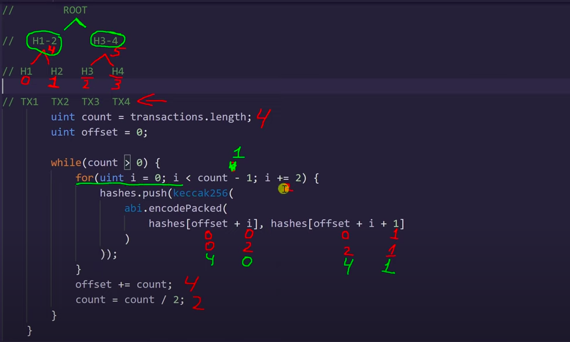

Дерево может состоят из 2^n элементов

При создании дерева на нижнем уровне хэшируется каждый элемент, после 
хэшируются каждые 2 элемента и создают верхний уровень,
так происходит до тех пор пока не будет 1-н корневой элемент

https://www.youtube.com/watch?v=aYKt-usrPw8&list=PLWlFXymvoaJ92awHVDO0oSy0z0ZFJifDV&index=16